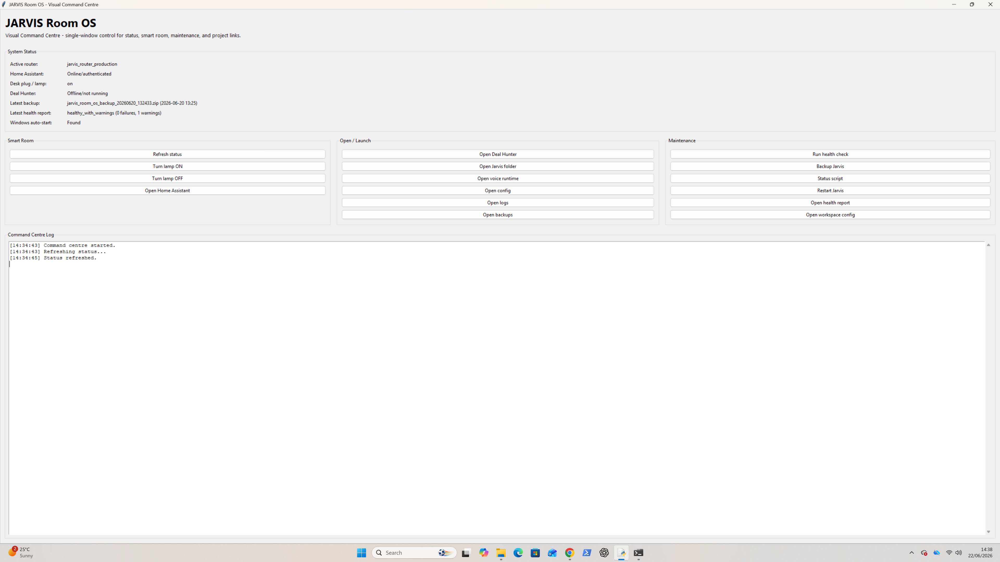
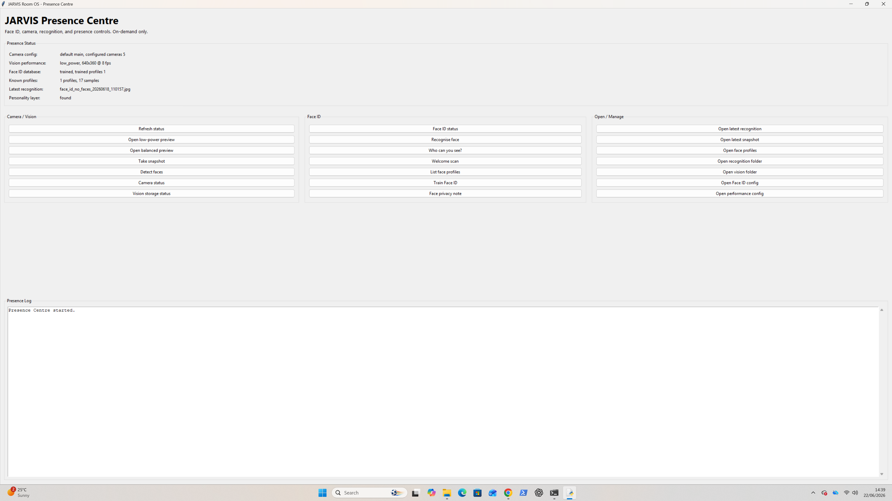
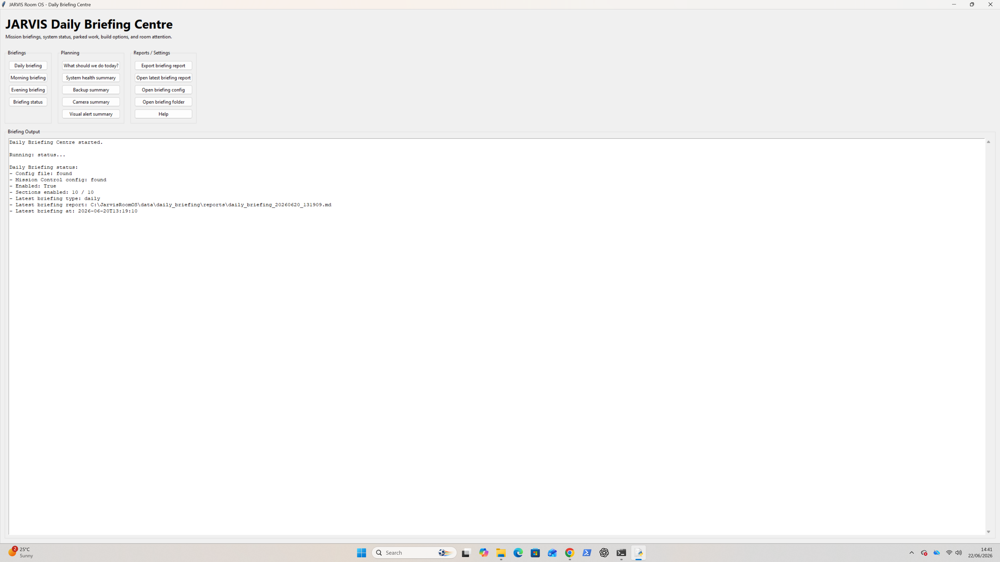
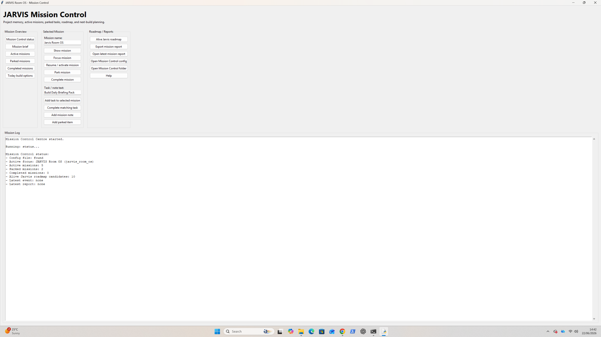
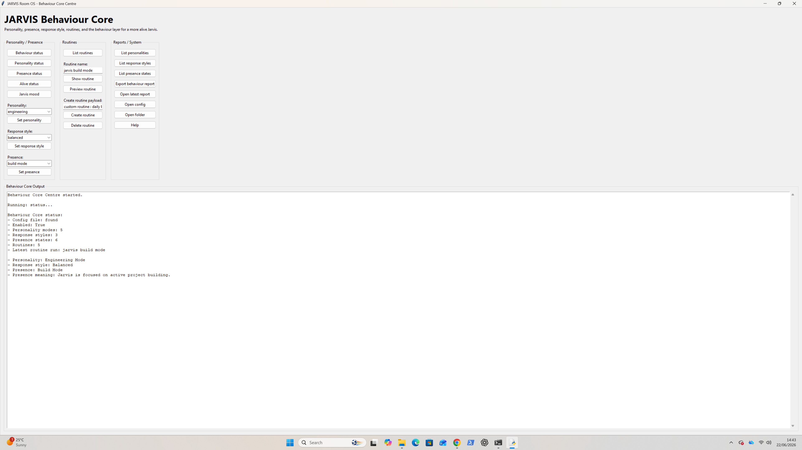
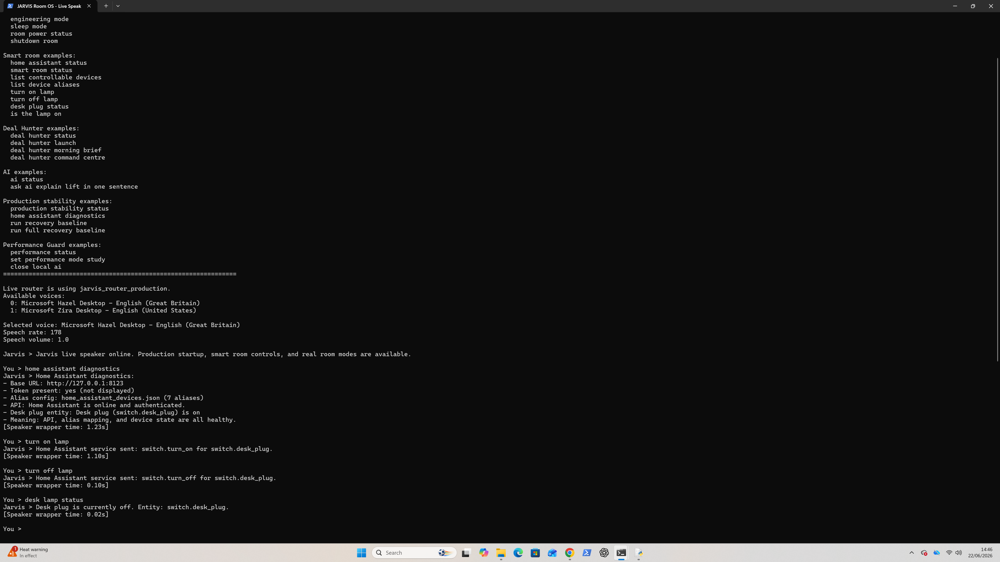

# JARVIS Room OS

> A modular, Windows-first personal assistant project combining smart-room automation, local AI, on-demand vision, performance-aware safeguards, and self-maintenance tooling.


## Why this project exists

JARVIS Room OS is an ongoing engineering project exploring what a useful, local-first personal assistant looks like when it can interact with a real desk environment rather than only a chat window.

The system is designed around practical capability rather than a single giant model. It combines a command router, Home Assistant smart-room control, modular feature bridges, performance safeguards, camera/gesture foundations, local AI, dashboards, reporting, recovery tooling, and project memory.

> **Public portfolio edition:** This repository intentionally contains a sanitised, portfolio-focused subset of the live project. Device tokens, private camera/face data, room layouts, logs, backups, local paths, and environment-specific configuration are excluded.

## Current capability snapshot

| Area | What is working |
|---|---|
| Smart room | Home Assistant integration with friendly aliases and real device state/control |
| Production routing | Direct plugin-style dispatch replacing a long version-to-version router chain |
| Local AI | LM Studio-compatible local AI route with model/status diagnostics |
| Safety | Study Mode blocks AI and intensive maintenance while keeping room controls available |
| System health | Backups, health checks, self-maintenance, notifications, and recovery baseline tooling |
| Assistant behaviour | Personality modes, presence states, routines, Mission Control, and Daily Briefing |
| Vision foundations | On-demand camera tools, Face ID foundation, visual memory, multi-camera groundwork |
| Gesture foundations | MediaPipe hand tracking, gesture/turret experiments, and performance controls |
| Workspace support | Launchers for development, study, aerospace, Deal Hunter, and maintenance workflows |

## Architecture

```text
                    ┌─────────────────────────────────────┐
                    │          JARVIS Typed Speaker        │
                    │     text / voice command interface   │
                    └──────────────────┬──────────────────┘
                                       │
                    ┌──────────────────▼──────────────────┐
                    │       Production Command Router      │
                    │  direct routing + safety boundaries  │
                    └───────┬─────────────┬──────────┬─────┘
                            │             │          │
          ┌─────────────────▼───┐ ┌───────▼──────┐ ┌─▼─────────────────┐
          │ Performance Guard   │ │ Home Assistant│ │ Local AI / LM Studio│
          │ study/build modes   │ │ smart devices │ │ on-demand reasoning │
          └─────────────────────┘ └──────────────┘ └────────────────────┘
                            │             │          │
       ┌────────────────────▼─────────────▼──────────▼─────────────────────┐
       │  Behaviour • Daily Briefing • Mission Control • Notifications      │
       │  Vision • Face ID • Gesture • Workspace • Deal Hunter integrations │
       └─────────────────────────────────────────────────────────────────────┘
```

More detail: [architecture](docs/ARCHITECTURE.md).

## Demonstrated engineering decisions

- **Modular bridges over a monolith:** capabilities are routed to isolated modules instead of embedding everything in one command file.
- **Real-world device control:** commands are mapped to safe Home Assistant entity aliases, then state is read back rather than assuming success.
- **Performance-aware automation:** the system checks memory/CPU conditions and blocks heavy work in Study Mode.
- **Graceful degradation:** smart-room controls, status checks, and dashboards remain usable even when local AI is intentionally disabled.
- **Recovery-first design:** snapshots, health checks, maintenance reports, and a recovery baseline reduce the risk of experimentation on a daily-use PC.
- **On-demand vision:** camera features are explicitly performance constrained rather than left permanently active.

## Public code included here

The `src/` folder contains a clean, safe reference implementation of three central patterns from the live build:

- `router.py` — direct plugin command routing.
- `performance_guard.py` — Windows resource awareness and Study Mode gating.
- `home_assistant_client.py` — token-safe Home Assistant client using environment variables.

Run the small test suite with:

```powershell
python -m unittest discover -s tests -v
```

## Interface snapshots

### Command Centre


### Presence Centre


### Daily Briefing


### Mission Control


### Performance Guard


### Smart Room Control


## Roadmap

1. Stabilise the 16 GB RAM upgrade and assess actual headroom.
2. Refresh Mission Control/Daily Briefing wording to match the production state.
3. Add **Screen Awareness Foundation**: safe, on-demand current-window context and screenshot capture.
4. Add a **Computer Control Safety Layer** before any automated clicking or typing.
5. Move Home Assistant to a dedicated spare PC when available.
6. Improve voice, wake-word, dashboard polish, and proactive assistant behaviour.

See [docs/ROADMAP.md](docs/ROADMAP.md).

## Security and privacy

Never commit Home Assistant tokens, local AI keys, `.env` files, camera captures, face samples, room maps, logs, backups, or real private configuration. Use [config examples](config_examples/) and read [SECURITY.md](SECURITY.md) before publishing changes.

## Licence

Copyright © 2026 Dean Cooke. All rights reserved. This repository is published for portfolio review and learning. See [LICENSE](LICENSE).

## Author

Built by [Dean Cooke](https://github.com/deancooke05) — MEng Aerospace Engineering with Pilot Studies student
